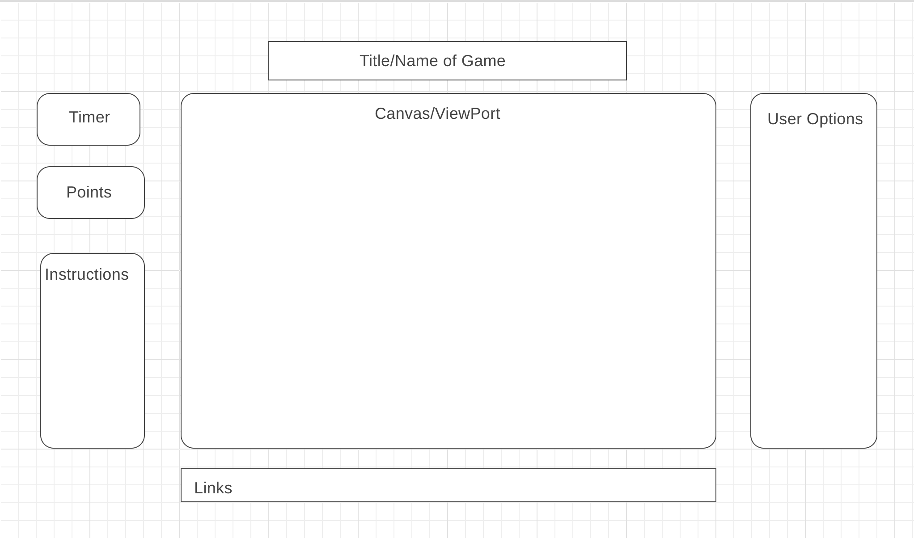

# MushroomStory

# Background and Overview
  * Motivation for the project is build a javascript game to learn how to make game physics, and make a light hearted game anyone can enjoy.
  * MushroomStory is a platform game where the player navigates through platforms using the game physics provided. 
  * MushroomStory's theme is based off Maplestory, which is a real game own by Nexon.
  
# Functionality and MVP features
## Main MVP
   * Player can move left/right, and jump off the floor, and walls
   * Player has to navigate through stages which gets increasingly harder.
   * Stage, and Player will be represented by sprites.
   * Animations is available for the Player.
   * Player can collect items to build up points.
   * There will be a scrollable viewport for each stage.
   * There will be a timer to time how long it took for the player to complete all the stages.
   * There will be music, and sound effects for moving, and jumping

## Bonus MVP (if time alloted)
   * Add enemies that hinders the player. Unforunately, Player won't be able to kill these enemies.
   * Add a point/timer record system.
  
# Architecture and Technologies 
  * HTML5 Canvas
  * Vanilla JS
  * Tiled for building maps
 
#Wireframe
 

# Implementation Timeline
## Day 1
### MVP1
  * Create the Javascript files for user control, and user physics.
  * Player has to able to move the character using left/right arrow keys
  * Player has to be able to jump and double jump with the space bar.
   
## Day 2
### MVP2
  * Create stage physics, and character stage interaction physics.
  * Player has to be able to stand on top of platforms.
  * Player has to be able to collide against walls, and roofs.
  * Player has to be able to slide against slideable walls.

## Day 3
### MVP2, MVP3, MVP4, MVP5
  * Design the stages with spritesheet, and aside the Player's character a sprite.
  * Create animations for the Player sprite.
  * Add the item sprites on the maps in which the User can collect to get points.
  * Create obstables for the stages, such as moving platforms.
## Day 4
### MVP6  
  * Work on the Scrollable Viewport for the stages.

## Day 5
### MVP7, and MVP8
  * Add the timer, and add music, and sound effects for the game.
  * Doll up the webpage with html, and css
  * Finish up whatever still needs work on.
